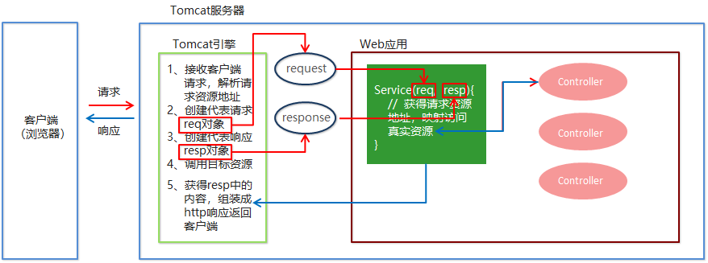

### SpringMVC快速入门

需求：客户端发起请求，服务器端接收请求，执行逻辑并进行视图跳转。

**开发步骤**

①导入SpringMVC相关坐标

②配置SpringMVC核心控制器DispathcerServlet

③创建Controller类和视图页面

④使用注解配置Controller类中业务方法的映射地址

⑤配置SpringMVC核心文件 spring-mvc.xml

⑥客户端发起请求测试

**代码实现**

①导入Spring和SpringMVC的坐标、导入Servlet和Jsp的坐标

```xml
 <!--Spring坐标-->
 <dependency>
     <groupId>org.springframework</groupId>
     <artifactId>spring-context</artifactId>
     <version>5.0.5.RELEASE</version>
 </dependency>
 <!--SpringMVC坐标-->
 <dependency>
     <groupId>org.springframework</groupId>
     <artifactId>spring-webmvc</artifactId>
     <version>5.0.5.RELEASE</version>
 </dependency>
<!--Servlet坐标-->
<dependency>
    <groupId>javax.servlet</groupId>
    <artifactId>servlet-api</artifactId>
    <version>2.5</version>
</dependency>
<!--Jsp坐标-->
<dependency>
    <groupId>javax.servlet.jsp</groupId>
    <artifactId>jsp-api</artifactId>
    <version>2.0</version>
</dependency>
```

②在web.xml配置SpringMVC的核心控制器

```xml
<servlet>
    <servlet-name>DispatcherServlet</servlet-name>
    <servlet-class>org.springframework.web.servlet.DispatcherServlet</servlet-class>  
    <init-param>
        <param-name>contextConfigLocation</param-name>
        <param-value>classpath:spring-mvc.xml</param-value>
    </init-param>
	<load-on-startup>1</load-on-startup>
</servlet>
<servlet-mapping>   
    <servlet-name>DispatcherServlet</servlet-name>
    <url-pattern>/</url-pattern>
</servlet-mapping>

```

③创建Controller和业务方法

```java
public class QuickController {
	public String quickMethod(){
		System.out.println("quickMethod running.....");
		return "index";
	}
}
```

③创建视图页面index.jsp

```jsp
<html>
<body>
    <h2>Hello SpringMVC!</h2>
</body>
</html>
```

④配置注解

```java
@Controller
public class QuickController {
	@RequestMapping("/quick")
	public String quickMethod(){
		System.out.println("quickMethod running.....");
			return "index";
	}
}
```

⑤创建spring-mvc.xml

```xml
<beans xmlns="http://www.springframework.org/schema/beans"  
    xmlns:mvc="http://www.springframework.org/schema/mvc"
    xmlns:context="http://www.springframework.org/schema/context" 
    xmlns:xsi="http://www.w3.org/2001/XMLSchema-instance"
    xsi:schemaLocation="http://www.springframework.org/schema/beans 
    http://www.springframework.org/schema/beans/spring-beans.xsd 
    http://www.springframework.org/schema/mvc   
    http://www.springframework.org/schema/mvc/spring-mvc.xsd  
    http://www.springframework.org/schema/context   
    http://www.springframework.org/schema/context/spring-context.xsd">
    <!--配置注解扫描-->
    <context:component-scan base-package="com.zjq"/>
</beans>
```

⑥访问测试地址

```xml
http://localhost:8080/zjq_springmvc1/quick 
```

控制台打印


页面显示


### SpringMVC流程图示



### 知识要点

SpringMVC的开发步骤 

   ①导入SpringMVC相关坐标

   ②配置SpringMVC核心控制器DispathcerServlet

   ③创建Controller类和视图页面

   ④使用注解配置Controller类中业务方法的映射地址

   ⑤配置SpringMVC核心文件 spring-mvc.xml

   ⑥客户端发起请求测试
 